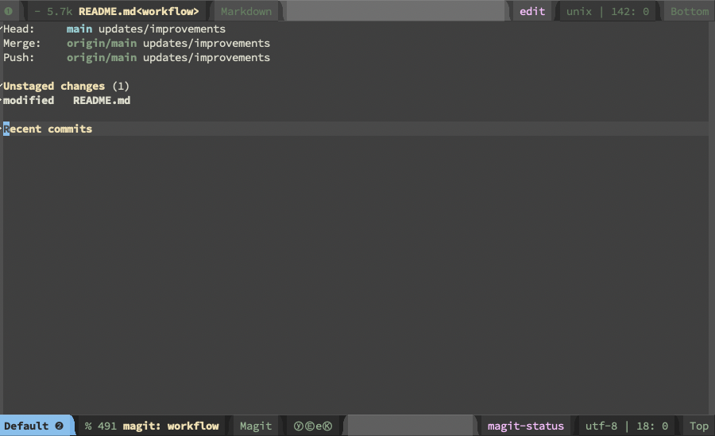

# workflow

This is just a simple note on how I take notes while working for the purposes of record keeping,
for showing myself and others what I've done, what worked, didn't work, etc.


**Contents**

- [Quick-start](#quick-start)
- [More details](#more-details)
    - [Magit](#magit)
    - [Markdown](#markdown)


--------------

## Quick-start

1. **Make a new local git repository**.

   ```
   mkdir workflow
   cd workflow
   git init
   ```

2. **Make a remote GitHub repository**.

   In your browser, go to [GitHub.com][], login, click the `+` icon on the top right and select "New repository."
   Give it a name, description, make it public or private and click the green button to create the remote repository.
   
3. **Link the remote and local repository**.

   After creating a new repository, you'll see a bunch of suggested ways to set it up.
   Copy the stuff in the section "…or push an existing repository from the command line."
   In the terminal window, at the command line, paste the stuff you just copied.   
   
4. **Create or edit a file in Emacs**.

   I like to create a new directory for each new task or collection of tasks I work on and,
   inside of that directory, create a `README.md` file containing notes about my work on the task.

   In the terminal, in the new repository directory, enter

   ```
   emacs README.md
   ```

5. **Make some notes**.

   In Emacs, edit the `README.md` file using the Markdown markup language.
   
   If you don't know about Markdown, see the [Markdown](#markdown) section below.
   
6. **Commit and push your notes to your repo from within Emacs**.

   This is the best part!  It will end up saving you a lot of keystrokes and mouse movement.
   
   In Emacs, type `C-x C-s` to save your work.  I recommend doing this *very* often. (I tend to do it after every single edit.)
   
   Use [magit](#magit) to commit changes to the local repository and push the changes to the remote (GitHub) repo as well.
   
   If you don't know about magit, see the [magit](#magit) section below.

----------------------

## More details
   
### Magit
   
Magit is an Emacs package that enables you to invoke git commands from within your Emacs session.
This saves you a lot of time, hassle, and keystrokes.
Because it incorporates git seamlessly into Emacs, `magit` promotes the habit of making many small, frequent git commits;
this in turn helps keep your repositories up-to-date.

#### Install Magit

Here are two ways to install the `magit` Emacs package. (Only do one of these.)

1.  * In Emacs, type `M-x`.
    * In the mini-buffer that appears at the bottom of the Emacs window, type `package-list-packages` and hit `Enter`.
    * In the Emacs buffer listing the available and installed packages, search for `magit` (using `C-s magit`).
    * With the cursor on the line showing the main `magit` package, type `i` (for install).
    * Type `x` to proceed with the install.

OR

2.  * In Emacs, type `M-x`.
    * In the mini-buffer that appears at the bottom of the Emacs window, type `package-install` and hit `Enter`.
    * In the mini-buffer, type `magit` and hit `Enter`.

#### Using magit

1.  After you make some changes to your emacs file that you want to commit to your repository, type `M-x magit`
    This should spawn a new Emacs buffer window showing you the status of your local repository.  An example is shown below.
    
    


2.  Move the cursor to the line of a file in the "Unstaged changes" section and type `s` (for "stage").
    If you want to stage all the files listed in the "Unstaged changes" section type `S` (for "stage all").
    
3.  Type `cc` (for "commit").  This will bring up a new buffer where you can insert a new commit message.

4.  Type a commit message and then type `C-c C-c`.

5.  To push your local changes to the remote GitHub repo, type `Pp`.


### Markdown

Markdown is a nice and easy markup language that's useful for quickly typesetting notes, small documents, and 
web page content in a way that looks quite nice on web pages served by sites (like [GitHub.com][])
that know how to process and typeset markdown files.

Markdown is *very* easy to learn and, even if you don't know it yet, you can begin writing nice 
Markdown files in a matter of minutes.

There are many resources on the web that teach you how to do this. Here are some
examples that a quick Google search turns up: [markdowntutorial.com][] or [markdownguide.org][].
   
#### Markdown tips

There are many tricks for making short work of creating nice looking, useful notes in Markdown (including ToC generation, images, hyperlinks, etc).
For example, you can install the Emacs package `markdown-toc` to make the command `markdown-toc-generate-toc` available;
it generates tables of contents (like the one at the top of this `README.md` file!).

Here are a few of my favorite markdown tips.

-  **Turn off smartparens-mode**  Especially if you're using Spacemacs, you may
   wish to turn off `smartparens-mode`.  It seems `smartparens-mode` is
   activated by default in Spacemacs and, when editing in `markdown-mode`,
   `smartparens-mode` seems to automatically add matching asterisks in
   the wrong place when you try to bold a word or phrase with double asterisks.

   To turn `smartparens-mode` off in a particular buffer, type `M-x smartparens-mode`.
   
   To turn off `smartparens-mode` globally, put the following line in your emacs
   config file; e.g., `.emacs` (if you use plain vanilla emacs) or the 
   `defun dotspacemacs/user-config ()` section of `.spacemacs` (if you use spacemacs):

   ```lisp
   (spacemacs/toggle-smartparens-globally-off)
   ```

-  **Hyperlinks**. I like to collect all hyperlink targets and labels at the
   bottom of my markdown file.
   
   *Example*. I put the line

   ```markdown
   [GitHub.com]: https://github.com/
   ```

   at the bottom of my `README.md` file. Then the hyperlink [GitHub][] can be
   added to the document by typing `[GitHub][]`.
   
-  **Images**.  I often take a screenshot of something I did and store them in a
   subdirectory of my repo called `img`.

   *Example*. I take a screenshot and save it to a file called `img/magit.png`. 
   Then I add the screenshot to my document by including the following line in
   my markdown file.

   ```
   
   ```
   
-  **Shortcuts**. 

   - `C-c C-l` (markdown-insert-link) 

**Refs**. [markdown-mode][]

----------------------------------


### Links mentioned above

|  |  |
|--|--|
| [markdown-mode][] | https://jblevins.org/projects/markdown-mode/ |
| [GitHub.com][] |  https://github.com/ |
| [markdowntutorial.com][] | https://www.markdowntutorial.com/ |
| [markdownguide.org][] | https://www.markdownguide.org/ |

[markdown-mode]: https://jblevins.org/projects/markdown-mode/
[GitHub.com]: https://github.com/
[markdowntutorial.com]: https://www.markdowntutorial.com/
[markdownguide.org]: https://www.markdownguide.org/
